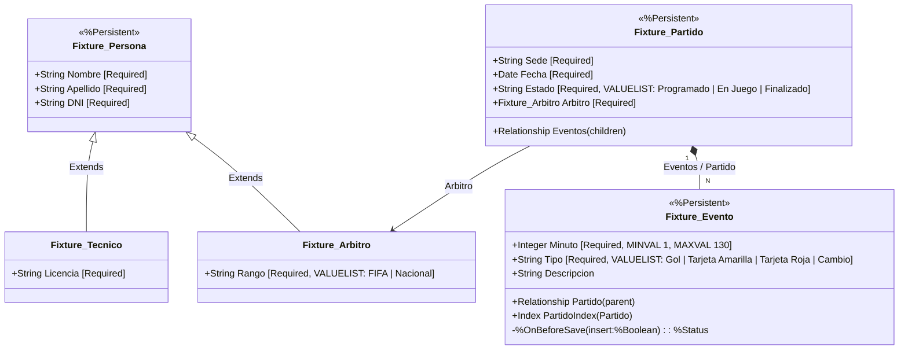

# Módulo Hito 9: Entidades Complejas en InterSystems IRIS

Este módulo implementa la abstracción orientada a objetos de una porción compleja del dominio del Fixture 2030. Se han construido clases persistentes en InterSystems IRIS para gestionar entidades que exceden el simple almacenamiento de datos, encapsulando integridad referencial, jerarquías y validaciones directamente en la base de datos.

## 1. Diagrama de Objetos (UML)

A continuación se presenta el modelo estructural diseñado, utilizando herencia clásica y una relación fuerte Padre-Hijo.



## 2. Matriz de Integridad

Las reglas de integridad implementadas garantizan la consistencia del modelo directamente en la base de datos, sin depender de la aplicación (ORM externo):

| Regla de Integridad | Implementación en IRIS | Comportamiento en la Base de Datos |
| :--- | :--- | :--- |
| **Integridad Referencial Bidireccional** | Relación `parent`/`children` entre `Partido` y `Evento`. | Al insertar un Evento en la colección de un Partido, IRIS actualiza la propiedad inversa: desde el evento se llega a su partido (`evento.Partido.Sede`) y desde el partido a sus eventos. |
| **Dependencia de Ciclo de Vida (Borrado en Cascada)** | `[ Cardinality = children ]` en `Eventos`. El ID del evento es `idPartido\|\|n`. | Si se borra un `Partido` (`%DeleteId()`), IRIS borra todos sus `Eventos`: un evento no tiene sentido sin su partido. |
| **Guardado atómico del grafo** | Un solo `%Save()` sobre el padre. | Se guardan el partido y sus eventos juntos. Si algún evento es inválido (por ejemplo, minuto 0), no se guarda nada, tampoco el partido. |
| **Árbitro obligatorio** | `Property Arbitro As Fixture.Arbitro [ Required ]` en `Partido`. | No se puede guardar un partido sin árbitro asignado. Solo se acepta un objeto `Arbitro`, no cualquier `Persona`. Borrar un árbitro no borra sus partidos. |
| **Campos Obligatorios** | `[ Required ]` en las propiedades clave. | Si se intenta guardar un Partido sin `Sede`, o una Persona sin `DNI`, el guardado es rechazado con un error. |
| **Valores permitidos** | `VALUELIST` en `Estado`, `Tipo` y `Rango`; `MINVAL`/`MAXVAL` en `Minuto`. | Se rechazan estados o tipos de evento que no estén en la lista y minutos fuera de 1..130 (por ejemplo, un evento en el minuto 0). |
| **Validación de Transición de Estado** | `%OnBeforeSave()` en `Fixture.Evento`. | Prohíbe insertar eventos nuevos si el `Partido` está en estado "Finalizado". El guardado se aborta si no pasa la regla. |

## 3. Código Fuente del Dominio

Todo el código de dominio y las entidades están centralizados en el archivo XML de importación unificado: 
- [`scripts/Fixture.Clases.cls`](scripts/Fixture.Clases.cls)

Esta definición empaqueta las clases base (`Persona`), herencias especializadas (`Arbitro`, `Tecnico`), y el agregado complejo padre-hijo (`Partido` y `Evento`).

## 4. Operativa

Para compilar, instanciar y navegar los objetos en el entorno local (cumpliendo RNF2 y RNF4):

1. Crear el directorio durable con los permisos que indica la Clase 10 y levantar el servicio (desde `fixture2030-iris/`):
   ```bash
   mkdir -p ~/docker/data/iris
   sudo chown -R "$(id -u):$(id -g)" ~/docker/data/iris
   sudo chmod -R 777 ~/docker/data/iris
   docker compose up -d
   docker compose ps
   ```
   Si el contenedor no puede escribir en `/durable`, hacer `docker compose down`, repetir el `chown` y el `chmod`, y volver a levantarlo.
2. Ingresar al terminal de ObjectScript del contenedor:
   ```bash
   docker exec -it fixture2030-iris iris session IRIS
   ```
3. Dentro del prompt `USER>`, importar y compilar las clases del modelo y el script de la demo:
   ```objectscript
   Do $system.OBJ.Load("/scripts/Fixture.Clases.cls", "ck")
   Do $system.OBJ.Load("/scripts/DemoOperaciones.mac", "ck")
   ```
4. Ejecutar la demostración operativa:
   ```objectscript
   Do ^DemoOperaciones
   ```

El script de demostración (`scripts/DemoOperaciones.mac`) realiza automáticamente las siguientes comprobaciones:
- **Herencia (RF4):** Crea un `Arbitro` y un `Tecnico`, que extienden `Persona`.
- **Carga atómica (RF6):** Crea un partido con su árbitro y dos eventos en memoria y ejecuta un único `%Save()` sobre el padre para guardar el grafo entero.
- **Navegación (RF7):** Abre el partido guardado desde el disco mediante `%OpenId()`, navega al árbitro (`partido.Arbitro.Apellido`), recorre los eventos con `GetAt()` y vuelve del evento al partido (`evento.Partido.Sede`).
- **SQL Multimodelo (RF8):** Ejecuta `SELECT` con `%ResultSet` sobre las tablas proyectadas `Fixture.Partido`, `Fixture.Evento` y `Fixture.Persona` (que incluye las filas de Arbitro y Tecnico), y muestra que coinciden con los objetos creados.
- **Campo obligatorio (RF5):** Intenta guardar un partido sin `Sede` y muestra el error de IRIS.
- **Validación (RF9):** Cambia el estado del partido a "Finalizado" en memoria y trata de insertarle un evento extra para provocar y capturar el rechazo dictado por la regla interna `%OnBeforeSave()`. También intenta guardar un evento en el minuto 0, que se rechaza por `MINVAL`, y comprueba que el partido nuevo tampoco se guardó.

Para salir del Terminal: `Halt`.

## 5. Evidencia de Ejecución

La evidencia se generó con `bash tools/generar_evidencia.sh` (desde `fixture2030-iris/`, con el contenedor levantado), que compila las clases, corre la demo y guarda la salida del Terminal de IRIS en `docs/evidencia/`. La ejecución registrada es del 2026-10-09 con IRIS Community 2026.2 (Build 221U), partiendo de `~/docker/data/iris` vacío.

| Archivo | Qué muestra |
| :--- | :--- |
| [`00_ambiente.txt`](docs/evidencia/00_ambiente.txt) | Contenedor levantado y versión de IRIS. |
| [`01_compilacion.txt`](docs/evidencia/01_compilacion.txt) | Las 5 clases y la rutina compilan sin errores (RNF2). |
| [`02_demo.txt`](docs/evidencia/02_demo.txt) | Salida completa de `Do ^DemoOperaciones`: objetos guardados, navegación, SQL y los tres rechazos (sin `Sede`, partido Finalizado y minuto 0). |
| [`03_persistencia.txt`](docs/evidencia/03_persistencia.txt) | Después de `docker restart`, las consultas SQL devuelven los mismos datos: el partido (ya Finalizado), sus 2 eventos y las 2 personas. El partido con el evento en el minuto 0 no existe. |
