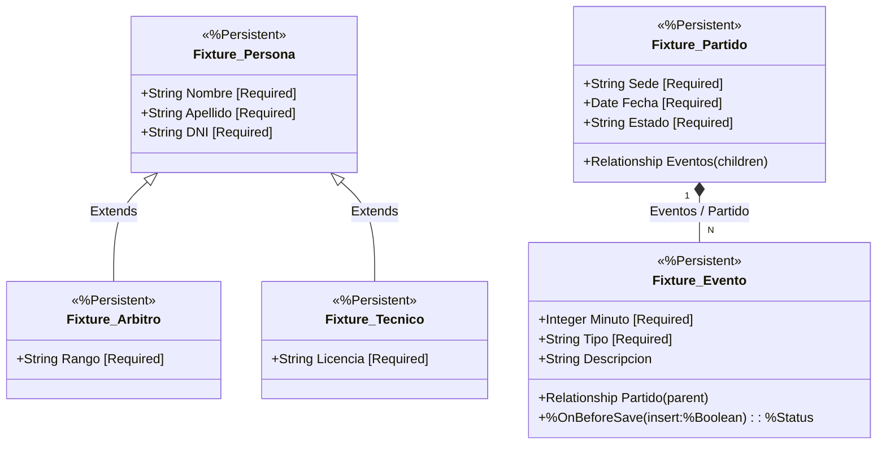

# Módulo Hito 9: Entidades Complejas en InterSystems IRIS

Este módulo implementa la abstracción orientada a objetos de una porción compleja del dominio del Fixture 2030. Se han construido clases persistentes en InterSystems IRIS para gestionar entidades que exceden el simple almacenamiento de datos, encapsulando integridad referencial, jerarquías y validaciones directamente en la base de datos.

## 1. Diagrama de Objetos (UML)

A continuación se presenta el modelo estructural diseñado, utilizando herencia clásica y una relación fuerte Padre-Hijo.



## 2. Matriz de Integridad

Las reglas de integridad implementadas garantizan la consistencia del modelo directamente en la base de datos, sin depender de la aplicación (ORM externo):

| Regla de Integridad | Implementación en IRIS | Comportamiento en la Base de Datos |
| :--- | :--- | :--- |
| **Integridad Referencial Bidireccional** | Relación `parent`/`children` entre `Partido` y `Evento`. | Al asignar un Evento a la colección de un Partido, IRIS automáticamente actualiza la propiedad inversa (el Evento sabe a qué Partido pertenece). |
| **Dependencia de Ciclo de Vida (Borrado en Cascada)** | Modificador `[ Cardinality = children ]` en la propiedad `Eventos`. | Si se ejecuta un `%DeleteId()` sobre un objeto `Partido`, la base de datos elimina automáticamente todos sus `Eventos` asociados, ya que un evento carece de sentido sin su partido correspondiente. |
| **Campos Obligatorios Restrictivos** | Modificador `[ Required ]` en propiedades clave. | Si se intenta guardar (`%Save()`) un Partido sin `Sede`, o una Persona sin `DNI`, el guardado es rechazado atómicamente retornando un error al invocador. |
| **Validación de Transición de Estado** | Método encapsulado `%OnBeforeSave()` sobreescrito en `Fixture.Evento`. | Impide la inserción de eventos con minuto negativo (`< 0`) y prohíbe agregar cualquier evento si el objeto padre (`Partido`) se encuentra en estado "Finalizado". Todo el guardado se aborta si no pasa la regla. |

## 3. Código Fuente del Dominio

Todo el código de dominio y las entidades están centralizados en el archivo XML de importación unificado: 
- [`scripts/Fixture.Clases.cls`](scripts/Fixture.Clases.cls)

Esta definición empaqueta las clases base (`Persona`), herencias especializadas (`Arbitro`, `Tecnico`), y el agregado complejo padre-hijo (`Partido` y `Evento`).

## 4. Operativa

Para compilar, instanciar y navegar los objetos en el entorno local (cumpliendo RNF2 y RNF4):

1. Levantar el servicio asegurando que el host tenga correctamente montado el volumen (como se indica en las consignas):
   ```bash
   docker compose up -d iris
   ```
2. Ingresar al terminal de ObjectScript del contenedor:
   ```bash
   docker compose exec iris iris session iris
   ```
3. Dentro del prompt `USER>`, importar y compilar las clases del modelo y el script de la demo:
   ```objectscript
   Do $system.OBJ.Load("/scripts/Fixture.Clases.cls", "ck")
   Do $system.OBJ.Load("/scripts/DemoOperaciones.mac", "ck")
   ```
4. Ejecutar la demostración operativa:
   ```objectscript
   Do ^DemoOperaciones
   ```

El script de demostración (`scripts/DemoOperaciones.mac`) realiza automáticamente las siguientes comprobaciones:
- **Carga atómica (RF6):** Crea un partido con dos eventos en memoria y ejecuta un único `%Save()` sobre el padre para guardar el grafo entero.
- **Navegación (RF7):** Abre el partido guardado desde el disco mediante `%OpenId()`, y usa un bucle clásico de objetos (`GetAt()`) para navegar la lista de eventos referenciados.
- **SQL Multimodelo (RF8):** Ejecuta una consulta con `%ResultSet` sobre la tabla proyectada automáticamente (`Fixture.Evento`) para demostrar el acceso relacional tradicional.
- **Validación (RF9):** Cambia el estado del partido a "Finalizado" en memoria y trata de insertarle un evento extra para provocar y capturar el rechazo dictado por la regla interna `%OnBeforeSave()`.

## 5. Evidencia de Ejecución

> **Nota para los evaluadores:** 
> A continuación se adjunta la captura del terminal evidenciando la compilación sin errores y la ejecución correcta de las pruebas, demostrando la carga de objetos y las validaciones rechazadas apropiadamente.


